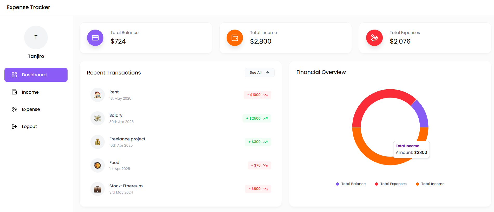
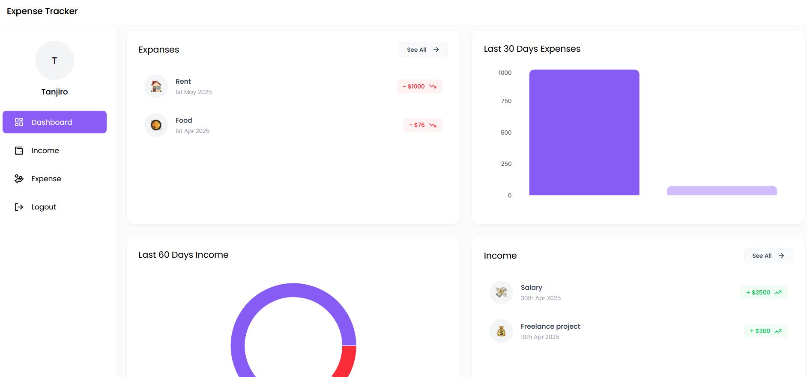
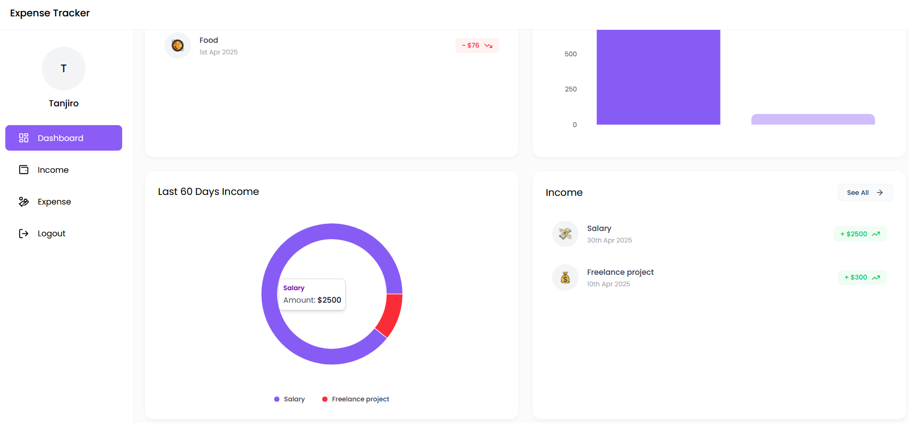
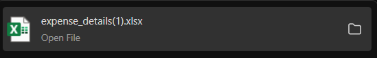
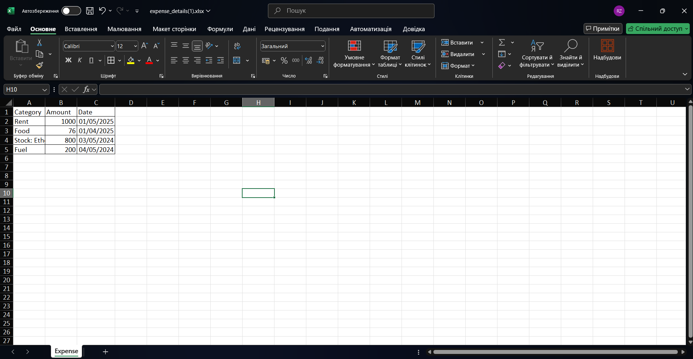
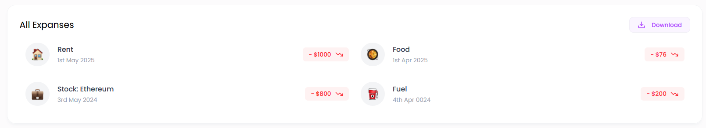
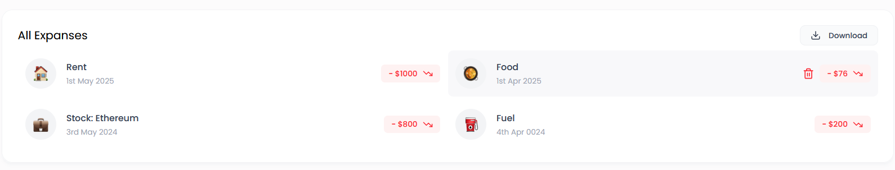
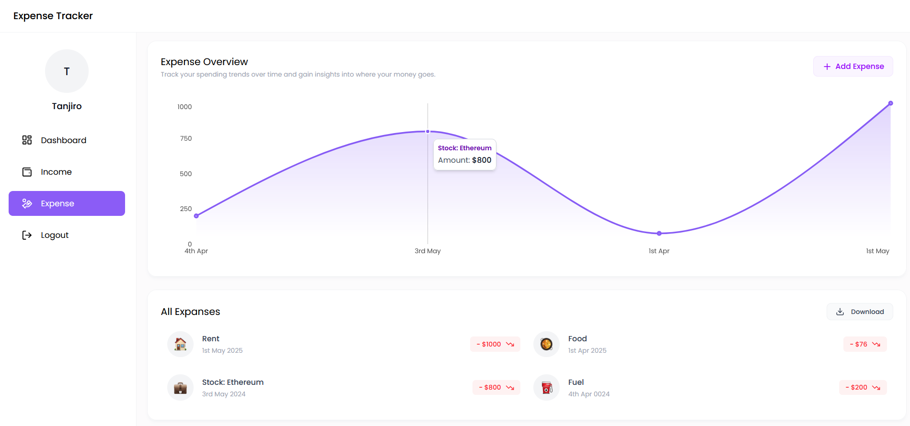

# Expense Tracker Application

Welcome to my **Expense Tracker** project — a full-stack application built with **MERN stack** (MongoDB, Express.js, React, Node.js) and **Tailwind CSS**.

This project allows users to **track their income and expenses**, **visualize financial data** through graphs, and **download reports in Excel format**.

---

## Features

- User Authentication (Sign Up / Log In)
- Add and manage Income & Expense records
- **Dynamic Graphs**: Pie Chart, Bar Chart, Line Chart
- **Excel Download** for both Income and Expense data
- Financial Overview Dashboard
- Profile Picture Upload
- Responsive and Modern UI with Tailwind CSS

---

## Special Highlights

- **Excel File Export**:
  - Users can download all their incomes and expenses as `.xlsx` files with one click.
  - Makes tracking and sharing financial records very convenient.

- **Financial Data Visualization**:
  - Beautiful interactive charts help users understand their income/expense trends clearly.
  - Uses Pie, Line, and Bar charts for different sections.

- **Modern UI**:
  - Fully responsive, mobile-friendly design.
  - Built with Tailwind CSS to maintain consistent styles easily.

---

## Technology Stack

- **MERN Stack**: [Learn about MERN](https://www.mongodb.com/mern-stack)
- **Frontend**: [React.js](https://react.dev/) + [Tailwind CSS](https://tailwindcss.com/)
- **Backend**: [Node.js](https://nodejs.org/) + [Express.js](https://expressjs.com/)
- **Database**: [MongoDB Atlas](https://www.mongodb.com/atlas/database)
- **Authentication**: [JWT (JSON Web Tokens)](https://jwt.io/)
- **Charts**: [Recharts](https://recharts.org/en-US/)
- **Excel Handling**: [SheetJS (xlsx)](https://sheetjs.com/)

---

## Screenshots

### Dashboard View



### Financial Overview



### Expenses Overview



### Incomes Overview



### Download Income Excel



### Download Expense Excel



### Expense Graph



### Income Graph



---

## How to Run Locally

1. **Clone the repository**

```bash
git clone https://github.com/wwtanji/expense-tracker.git
cd expense-tracker
```

2. **Install backend dependencies**

```bash
cd backend
npm install
```

3. **Install frontend dependencies**

```bash
cd ../frontend
npm install
```

4. **Configure environment variables**

Create a `.env` file inside the `backend/` directory:

```env
MONGO_URI=your_mongodb_connection_string
JWT_SECRET=your_jwt_secret
PORT=your_port
```

5. **Run the backend**

```bash
cd backend
npm start
```

6. **Run the frontend**

```bash
cd frontend
npm run dev
```

The frontend will be available at [http://localhost:5173](http://localhost:5173) and backend at [http://localhost:5000](http://localhost:5000).

---

# Author: Roman Zotsenko
